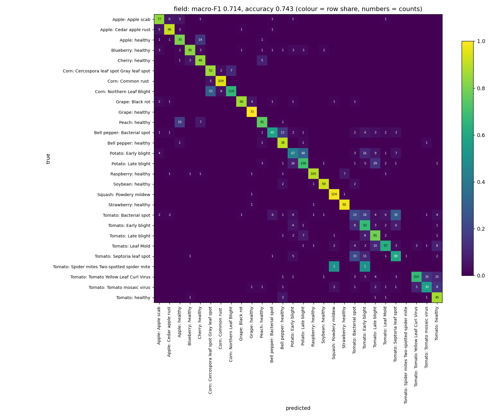
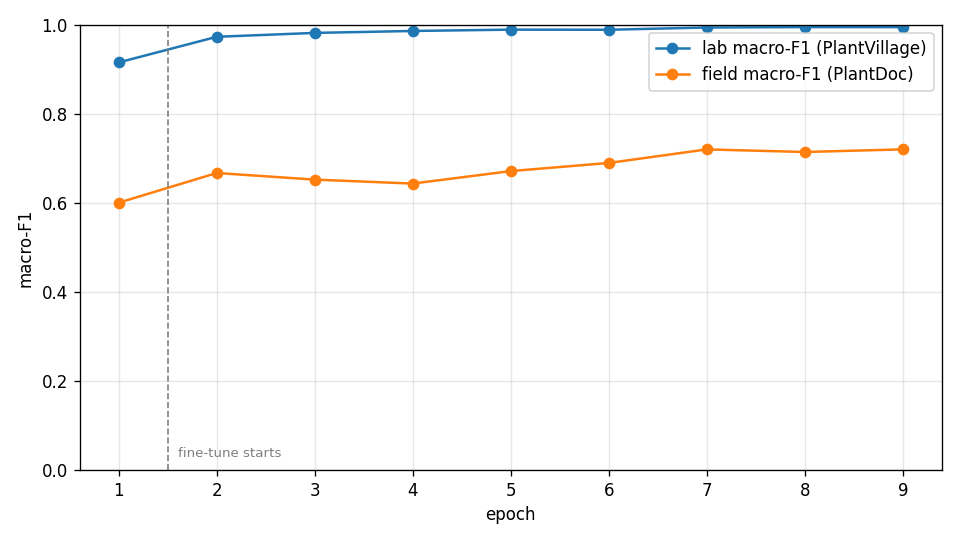

# Model report

**Run:** Kaggle `agrismart-train` version 2 (`e3b_dinov2s_natural_aug`), 10–11 September 2026 ·
**Weights:** release [`model-v2`](https://github.com/Vatsal2008/AgriSmart-AI/releases/tag/model-v2)

| Field | What we did |
|---|---|
| **Task** | Crop-disease image classification, 28 classes (18 diseases + 10 healthy). This is our draft list: the PlantVillage classes that also exist in PlantDoc. The organizers' official list replaces it at kickoff. |
| **Dataset & split** | **Train 35,257:** 31,022 PlantVillage lab photos (official leaf-grouped split, so no leaf is in both train and validation) + 4,235 field photos (PlantWild v2 diseases 1,975, PlantWild v1 healthy leaves 2,260). **Lab validation 7,520:** PlantVillage photos of other leaves. **Field validation 2,806:** PlantDoc photos, never trained on. 660 training candidates that looked like PlantDoc photos were removed (pHash distance ≤ 10 or DINOv2 cosine ≥ 0.93), and PlantDoc's own 58 duplicates and 58 label conflicts were dropped. Class counts: [dataset/summary.csv](dataset/summary.csv). |
| **Model / approach** | DINOv2 ViT-S/14 (self-supervised, 22 M parameters, timm `vit_small_patch14_dinov2.lvd142m`) at 224 px. Stage 1: 1 epoch training only the new head (lr 1e-3). Stage 2: 8 epochs fine-tuning everything (lr 2e-5 backbone, 2e-4 head, AdamW, weight decay 0.05, cosine schedule with 5% warm-up, label smoothing 0.1, batch 64, mixed precision). Half the PlantVillage training photos get their background replaced with field scenery. Natural augmentation: random crop (30–100%), flips, rotation, perspective, colour jitter, blur, random erasing. Class-balanced sampling, with field photos drawn 3× as often as lab photos. The checkpoint is chosen by field macro-F1. Training took 43.6 min on a Kaggle T4. |
| **Metric & result** | **Field (PlantDoc): macro-F1 0.714, accuracy 0.743** (averaging each image with its mirror; 0.720 without). **Lab (PlantVillage): macro-F1 0.995, accuracy 0.995.** Best field classes: squash powdery mildew 0.96, grape healthy 0.95, strawberry healthy 0.95, corn common rust 0.94. Worst: tomato bacterial spot 0.25, tomato mosaic virus 0.49, tomato early blight 0.51, potato early blight 0.51. Per-class precision/recall: [results/report_field.csv](results/report_field.csv), [results/report_lab.csv](results/report_lab.csv). |
| **Baseline** | Organizers' baseline: published at kickoff (pending). Reference: a PlantVillage-only ResNet-50 scores 0.285 macro-F1 on PlantDoc (21 classes, PMC13236948). Our own lab-only smoke test scored 0.390 on 4 classes. |
| **Limitations** | (1) PlantDoc chose the checkpoint; the last epoch won, so the bias is small, but 0.714 is slightly optimistic. (2) Small-spot tomato diseases (bacterial spot ↔ septoria) and potato early ↔ late blight are often confused; corn northern leaf blight is often called gray leaf spot. (3) Tomato spider mites has only 2 PlantDoc photos, so its F1 (0.0) means nothing. (4) PlantDoc contains label noise (e.g. a raspberry leaf labelled soybean) and watermarked stock photos. (5) The model always picks one of 28 classes and cannot say "not a leaf". (6) Photos of a phone screen add glare and moiré. |

**Inference on a laptop CPU (i7-13700H):** the model loads in about 7 s; each photo then takes about 0.2 s.
`python model/predict.py --image <photo>` in a fresh process takes 9–20 s including start-up.
